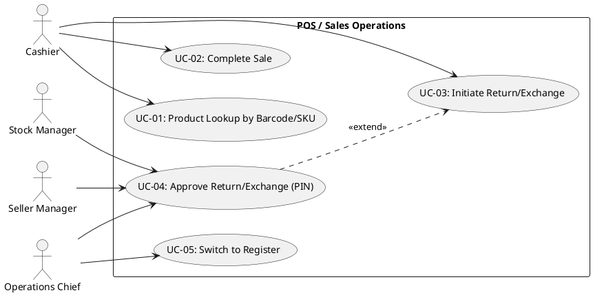
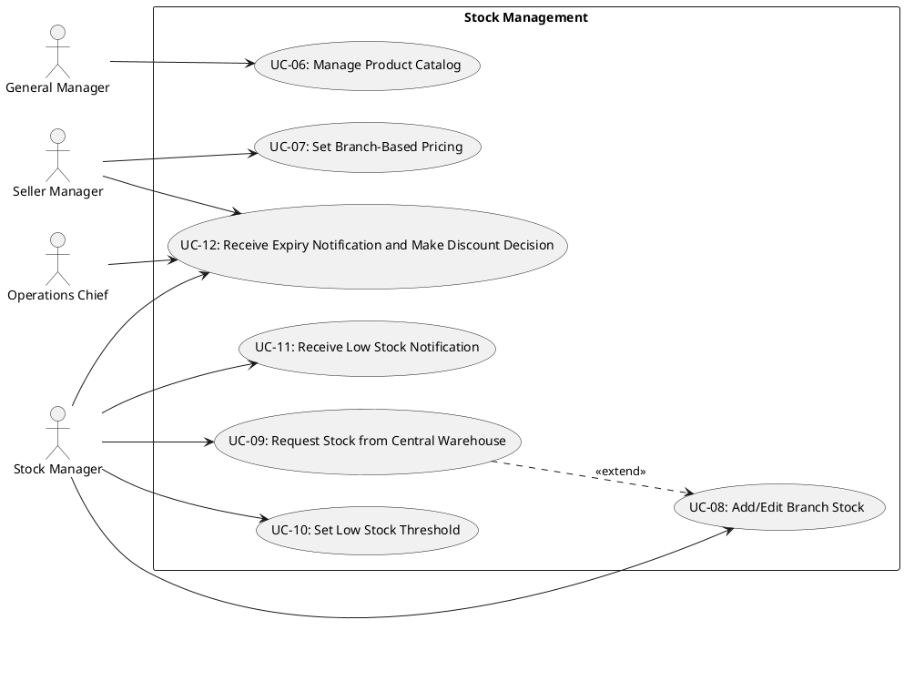
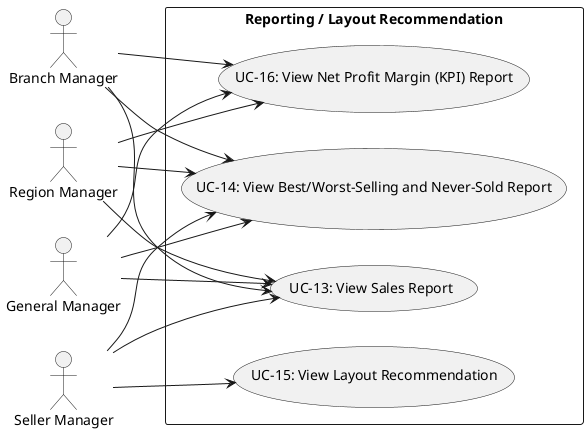
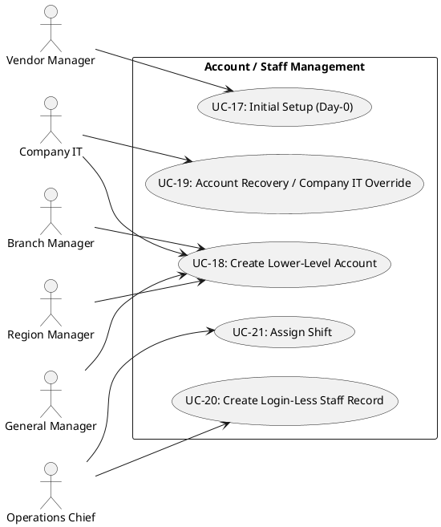
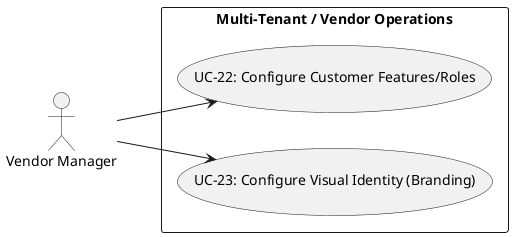
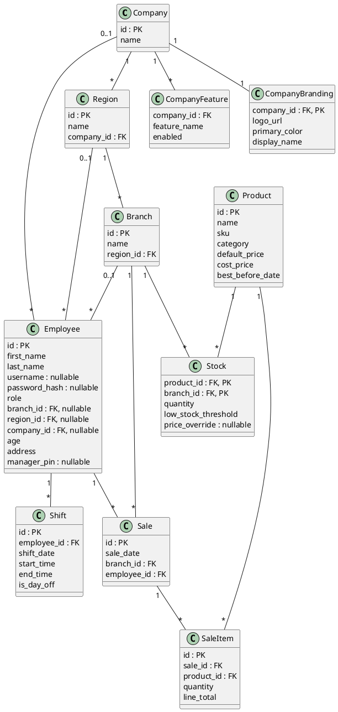

# StockSense — Software Requirements Specification (SRS)

This file holds the SRS content prepared based on the architectural decisions finalized in `stocksense-architecture-tr.md`. It is filled in section by section, as each part is discussed and approved.

> Reference: `stocksense-architecture-tr.md` (current architectural decisions), `topic.pdf` (project brief).

> **TODO (postponed):** Whether use cases for the mobile companion app (item 8) will be folded into existing UCs (UC-11, 13, 14, 16 — as read-only mobile access) or will require separate UCs has not been discussed yet — to be revisited once the Use Cases section is complete.

> **Section order** follows the components listed in the SRS content list in `stocksense-jira-sprint-plani.md`, except that the initial trio (Introduction, Audience, Scope) has been arranged in this order by user preference: Introduction, Audience, Scope, Use Cases, Component Table, Non-Functional Requirements, Functional Requirements, Diagrams (Class Diagram; the Use Case Diagram is kept directly under its own UC table for readability), Features List.

---

## Introduction

This document defines the functional and non-functional requirements of the StockSense project ("Stock Control POS & Store Remodeling Recommender"). The project, framed in the `topic.pdf` brief for a small-scale single store, was expanded by the instructor's verbal directive into **a product scalable to general businesses** (see `stocksense-architecture-tr.md` — "Scope Change"). Building on all the decisions finalized in the architecture file (role hierarchy, data model, multi-tenant structure, etc.), this SRS specifies what the system must do in the form of use cases, functional/non-functional requirements, and diagrams (Use Case, Class).

## Audience

- **Course instructor:** To evaluate the justified architectural/design decisions of the project.
- **Developer (project owner, solo):** As a reference document during implementation.
- **People who may join the project later** (if any): So they can quickly get up to speed — all decisions are recorded along with their rationale.

## Scope

**In scope:**
- POS/checkout operations (sales, return/exchange, concurrency safety)
- Branch-based stock management (adding/editing, low-stock threshold, central warehouse sourcing)
- Sales reporting (per product/category, best/worst sellers, never-sold items)
- Store layout recommendation — co-occurrence/Apriori-based
- Net profit margin (KPI) reporting
- Account and role hierarchy management (including Company IT and Vendor Manager)
- Staff/shift management
- Notification system (low stock, expiry)
- Multi-tenant infrastructure: per-customer feature/role configuration, visual identity (managed by the vendor)
- Mobile companion app (details TODO — to be discussed separately)

**Out of scope:**
- Real payment gateway integration (fully mocked)
- Automatic ordering to suppliers / purchase order management
- Physical supply chain/logistics management (there is a **choice** between central warehouse ↔ branch, but no physical shipping/logistics)
- Advanced inventory features such as variant/serial number tracking
- Computer-vision-based shelf/stock detection, robotic/AR store guidance
- Real-time synchronization (WebSocket) — polling was deemed sufficient

---

## Actors

Deputy roles (item 10) are not shown as separate actors since they have exactly the same authority as their principal — they are included under the principal actor. Login-less "Staff" (butcher, greengrocer, shelf-stocking staff, etc.) are not actors since they do not log into the system — they are only a data record managed by the Operations Chief.

1. **Cashier**
2. **Stock Manager** (including Deputy Stock Manager)
3. **Seller Manager** (including Deputy Seller Manager)
4. **Operations Chief**
5. **Branch Manager** (including Deputy Branch Manager)
6. **Region Manager** (including Deputy Region Manager)
7. **General Manager** (including Deputy General Manager)
8. **Company IT** (a company's own in-house technical team)
9. **Vendor Manager** (above tenant level — the platform role of the vendor)

---

## Use Cases

### POS / Sales Operations

| UC ID | Name | Actor(s) | Short Description | Related Item |
|---|---|---|---|---|
| UC-01 | Product Lookup by Barcode/SKU | Cashier | Displays product name/price/expiry information via barcode scan or manual SKU entry. | Item 15 |
| UC-02 | Complete Sale | Cashier | Adds products to the cart, selects payment method (cash/card — mocked), completes the sale; stock is decremented DB-atomically. **Alternate Flow:** in a simultaneous race for the last unit, the losing transaction is automatically rejected (item 3). | Item 3, 6 |
| UC-03 | Initiate Return/Exchange | Cashier | Initiates a return/exchange for a completed sale; the products to be returned and the amount are determined, and an approval (PIN) modal opens when completing the transaction. | Item 6 |
| UC-04 | Approve Return/Exchange (PIN) | Stock Manager, Seller Manager, Operations Chief | Approves the return/exchange set up by the cashier with their own PIN, when the transaction is **completed** (the PIN is requested at completion, not at initiation). | Item 6 |
| UC-05 | Switch to Register | Operations Chief | Switches to the POS interface from the panel without re-login. | Item 2 |

### Stock Management

| UC ID | Name | Actor(s) | Short Description | Related Item |
|---|---|---|---|---|
| UC-06 | Manage Product Catalog | General Manager | Adds/edits new products at company level (name, SKU, category, `default_price`). | Item 4 |
| UC-07 | Set Branch-Based Pricing | Seller Manager | Enters/removes a branch-specific `price_override` for a product. | Item 4 |
| UC-08 | Add/Edit Branch Stock | Stock Manager | Updates branch stock quantity. | Item 3 |
| UC-09 | Request Stock from Central Warehouse | Stock Manager | Requests a product from the central warehouse when branch stock is insufficient. | Item 11 |
| UC-10 | Set Low Stock Threshold | Stock Manager | Sets the configurable low-stock threshold per product. | Item 6 |
| UC-11 | Receive Low Stock Notification | Stock Manager (or the most specific active role holding this authority at that branch) | Receives a notification when stock drops below the threshold or is depleted. | Item 6, 14 |
| UC-12 | Receive Expiry Notification and Make Discount Decision | Stock Manager, Seller Manager, Operations Chief | Receives a notification for a product with an approaching expiry date; the Seller Manager makes the discount/shelf decision together with the Operations Chief. | Item 14 |

### Reporting / Layout Recommendation

| UC ID | Name | Actor(s) | Short Description | Related Item |
|---|---|---|---|---|
| UC-13 | View Sales Report | Branch Manager, Region Manager, General Manager, Seller Manager | Views a sales report by product/category over a selectable date range — visibility scales with hierarchy (Branch/Region/General Manager: their own branch/region/whole company). **Seller Manager is limited to their own branch only**, to provide input into the layout decision. | Item 5 |
| UC-14 | View Best/Worst-Selling and Never-Sold Product Report | Branch Manager, Region Manager, General Manager, Seller Manager | Lists best/worst-selling and never-sold products in a selected date range. **Seller Manager is limited to their own branch only.** | Item 5 |
| UC-15 | View Layout Recommendation | Seller Manager | Views the co-occurrence/Apriori-based shelf layout recommendation for their own branch and puts it into practice. | Item 5, 7 |
| UC-16 | View Net Profit Margin (KPI) Report | Branch Manager, Region Manager, General Manager | Net profit margin report calculated from `default_price`/`cost_price` — visibility scales with hierarchy, the General Manager can drill down to any branch they wish. | Item 12 |

### Account / Staff Management

| UC ID | Name | Actor(s) | Short Description | Related Item |
|---|---|---|---|---|
| UC-17 | Initial Setup (Day-0) | Vendor Manager | Creates the company/region/branch and the first top-level users (General Manager, Region Managers, Branch Managers) for a new business. | Item 6 |
| UC-18 | Create Lower-Level Account | Branch Manager, Region Manager, General Manager, Company IT | A higher-level role creates an account at the level below it (Branch Manager → Cashier/Stock Manager/Seller Manager; Region Manager → Branch Manager; General Manager → Region Manager; Company IT → General Manager). | Item 6 |
| UC-19 | Account Recovery / Company IT Override | Company IT | Password reset at any level, bulk account creation, or delegating account-creation authority to someone else (within their own company). | Item 6 |
| UC-20 | Create Login-Less Staff Record | Operations Chief | Creates a login-less staff record for butcher, greengrocer, shelf-stocking staff, etc. | Item 13 |
| UC-21 | Assign Shift | Operations Chief | Assigns shift hours and days off to all staff at the branch (with or without login). | Item 13 |

### Multi-Tenant / Vendor Operations

| UC ID | Name | Actor(s) | Short Description | Related Item |
|---|---|---|---|---|
| UC-22 | Configure Customer Features/Roles | Vendor Manager | Determines/updates which features (`company_features`) and which roles are active for a customer (company) — can be edited again anytime, not only at onboarding. | Item 10 |
| UC-23 | Configure Visual Identity (Branding) | Vendor Manager | Sets/updates a customer's logo, primary color, and business name (`company_branding`). | Item 10 |

---

## Use Case Diagram

For readability, this is presented as a separate sub-diagram for each functional area instead of one giant diagram. For the single combined view of all actor/UC relationships, see `stocksense-usecase-diagram.puml` (kept in a separate file, for general reference/verification purposes).

The relationships `UC-04 extends UC-03` (PIN approval, a conditional extension of the return/exchange flow) and `UC-09 extends UC-08` (requesting from the central warehouse, an extension triggered when branch stock is insufficient) are included.

### POS / Sales Operations

### Stock Management

### Reporting / Layout Recommendation

### Account / Staff Management

### Multi-Tenant / Vendor Operations

---

## Component Table

| Component | Description | Technology | Related Item |
|---|---|---|---|
| Backend API | All business logic, endpoints, authorization checks | Python + FastAPI | Item 8 |
| Database | Persistent data layer | PostgreSQL + SQLAlchemy (ORM) | Item 8, 9 |
| Web/POS Frontend | Cashier POS screen + manager dashboards | React | Item 8 |
| Mobile Companion App | Read-only mobile access (details TODO) | React Native | Item 8 |
| Analytics Module | Co-occurrence counting / Apriori association-rule mining | pandas + mlxtend | Item 7 |
| Auth & Tenant-Scoping Middleware | JWT verification + automatically filtering every query by `company_id`/`branch_id`/`region_id` scope | FastAPI middleware/dependency | Item 8, 10 |
| Notification Module | Routing low-stock and expiry notifications to the target role | Inside the Backend API | Item 6, 14 |
| Multi-Tenant Management Panel | Interface where the Vendor Manager performs per-customer feature/role/branding configuration | Web Frontend (Vendor Manager-only) | Item 10 |

---

## Non-Functional Requirements

Qualitative statements were preferred over concrete numeric targets — if performance/behavior below expectations is observed, it will be addressed during implementation.

**Performance**
- Report and sales queries must return within a time acceptable to the user (item 5 — Live Query, no cache/pre-aggregation).

**Security**
- Passwords are stored hashed, never in plain text (item 9).
- Auth is JWT-based and stateless (item 8).
- Multi-tenant isolation: every query is automatically filtered by `company_id`/`branch_id`/`region_id` scope at the middleware level; endpoints are not relied upon to remember this filter on their own (item 10).
- Multi-tenant login: the company is resolved from the login subdomain (`Host` header) to a `company_id`; the user's account must match this `company_id` — cross-tenant login attempts are blocked (item 16).
- The manager PIN is kept separate from, and shorter (4-6 digits) than, the main login password (item 6).
- Since no real payment integration is implemented, financial compliance requirements such as PCI-DSS are out of scope (item 6).

**Scalability**
- Concurrency safety (DB-atomic) does not need to know how many terminals/branches there are; it generalizes to N (item 3).
- Adding a new customer (tenant) does not require a schema/code change — only feature flag and role configuration (item 10).

**Usability**
- The POS interface must be designed so the cashier can quickly find products via barcode/manual SKU entry, without requiring special hardware integration (item 15).

**Localization**
- The interface is offered bilingually (TR/EN); the language is selected on the Login screen and can be changed from the user menu within the system (item 17). An i18n library (react-i18next) will be used on the React side during implementation.

**Maintainability**
- Unnecessary complexity (cache, WebSocket, polymorphic association, separate warehouse/shelf tables, etc.) was deliberately left out (YAGNI) — all these decisions are recorded with their rationale in the architecture file.
- Permission inheritance is implemented via a single rule + role-specific additional permissions model; a separate permission list is not written for each role (item 2).

**Hardware/Environment**
- The barcode scanner works as keyboard emulation — no separate hardware driver/integration is required (item 15).
- The database (PostgreSQL) runs as a Docker container in the development environment.

---

## Functional Requirements

Each FR is the requirement-statement translation of its related UC (no MoSCoW priority distinction was made — since most of the project scope goes beyond the brief, sprint prioritization is handled separately in Jira).

| FR ID | Description | Related UC |
|---|---|---|
| FR-01 | The system shall allow the cashier to view product information (name, price, expiry date) by scanning a barcode or manually entering the SKU. | UC-01 |
| FR-02 | The system shall allow the cashier to add products to the cart and complete the sale by selecting a payment method; stock shall be decremented DB-atomically. | UC-02 |
| FR-03 | The system shall allow the cashier to initiate a return/exchange for a completed sale. | UC-03 |
| FR-04 | The system shall allow the return/exchange to be approved via PIN by the Stock Manager, Seller Manager, or Operations Chief when the transaction is completed. | UC-04 |
| FR-05 | The system shall allow the Operations Chief to switch to the POS interface without re-login. | UC-05 |
| FR-06 | The system shall allow the General Manager to add/edit a new product in the company-level product catalog. | UC-06 |
| FR-07 | The system shall allow the Seller Manager to enter/remove a branch-based price override. | UC-07 |
| FR-08 | The system shall allow the Stock Manager to update branch stock quantity. | UC-08 |
| FR-09 | The system shall allow the Stock Manager to request stock from the central warehouse. | UC-09 |
| FR-10 | The system shall allow the Stock Manager to set a per-product low-stock threshold. | UC-10 |
| FR-11 | The system shall automatically send a notification to the relevant active role when stock drops below the threshold or is depleted. | UC-11 |
| FR-12 | The system shall send a notification to the relevant role for products with an approaching expiry date; the Seller Manager and Operations Chief shall be able to make a discount/shelf decision. | UC-12 |
| FR-13 | The system shall allow authorized roles (Branch/Region/General Manager, Seller Manager) to view a sales report by product/category over a selectable date range. | UC-13 |
| FR-14 | The system shall provide a report listing best/worst-selling and never-sold products. | UC-14 |
| FR-15 | The system shall allow the Seller Manager to view the co-occurrence/Apriori-based layout recommendation. | UC-15 |
| FR-16 | The system shall allow authorized roles to view the net profit margin (KPI) report. | UC-16 |
| FR-17 | The system shall allow the Vendor Manager to perform the initial setup (company/region/branch/first users) for a new business. | UC-17 |
| FR-18 | The system shall allow higher-level roles to create an account at a lower level. | UC-18 |
| FR-19 | The system shall allow Company IT to perform override operations such as password reset/bulk account creation. | UC-19 |
| FR-20 | The system shall allow the Operations Chief to create a login-less staff record. | UC-20 |
| FR-21 | The system shall allow the Operations Chief to assign shifts to all staff at the branch. | UC-21 |
| FR-22 | The system shall allow the Vendor Manager to configure per-customer features/roles. | UC-22 |
| FR-23 | The system shall allow the Vendor Manager to configure per-customer visual identity (logo/color/name). | UC-23 |

---

## Diagrams

### Class Diagram

A direct reflection of the database schema in the architecture file (item 9 — base schema, item 10 — multi-tenant tables) — no separate conceptual/domain abstraction was made (`Employee` is a single class, `role` is an attribute; no inheritance is used). Among the `role` values, **Vendor Manager** and **Company IT** now replace the old (single) Admin; since the Vendor Manager is above the tenant level, all three of `branch_id`/`region_id`/`company_id` are null. `CompanyFeature`'s field structure was not defined in item 10 — here it is modeled as one row per feature (`company_id, feature_name, enabled`), so that new features can be added without a schema change.

> For the Use Case Diagram, see the "Use Case Diagram" section above (kept directly under each UC table, not moved separately, for readability).

---

## Features List

- **POS / Sales:** Product lookup by barcode/SKU, sale completion (concurrency-safe), return/exchange (PIN-approved), switch-to-register for the Operations Chief.
- **Stock Management:** Product catalog (centralized), branch-based price/stock management, central warehouse stock requests, low-stock and expiry notifications.
- **Reporting & Layout:** Sales reports (selectable date range), best/worst/never-sold product report, co-occurrence/Apriori-based shelf layout recommendation, net profit margin (KPI) report.
- **Account & Staff:** Hierarchical account creation, Company IT override, login-less staff records, shift management.
- **Multi-Tenant:** Per-customer feature/role toggling, visual identity customization.
- **Mobile:** Read-only companion app (details TODO).
