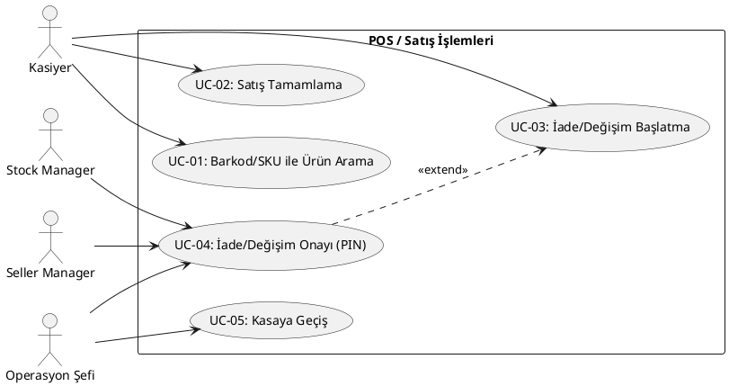
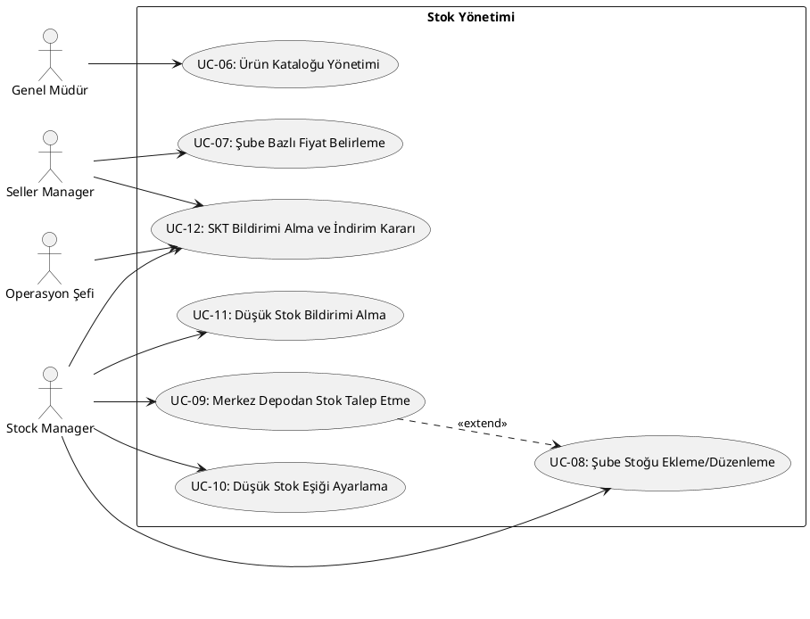
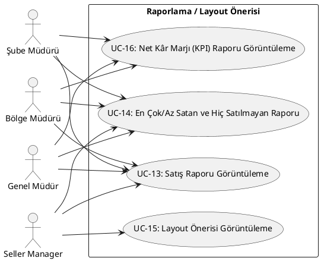
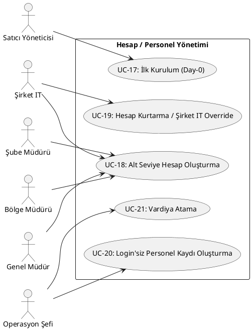
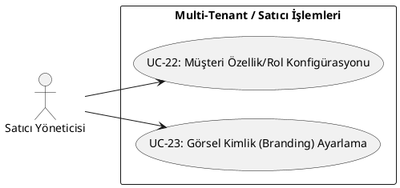
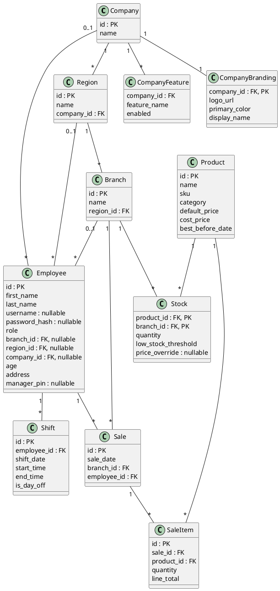

# StockSense — Software Requirements Specification (SRS)

Bu dosya, `stocksense-architecture-tr.md`'de netleşen mimari kararlara dayanarak hazırlanan SRS içeriğini tutar. Bölüm bölüm, tartışılıp onaylandıkça buraya işlenir.

> Referans: `stocksense-architecture-tr.md` (güncel mimari kararlar), `topic.pdf` (proje brifi).

> **TODO (ertelendi):** Mobil companion app (madde 8) için use case'lerin mevcut UC'lere mi (UC-11, 13, 14, 16 — salt-okunur mobil erişim olarak) dahil edileceği, yoksa ayrı UC'ler mi gerekeceği henüz konuşulmadı — Use Case'ler bölümü tamamlandıktan sonra geri dönülecek.

> **Bölüm sırası**, `stocksense-jira-sprint-plani.md`'deki SRS içerik listesindeki bileşenleri kullanır, ancak baştaki üçlü (Introduction, Audience, Scope) kullanıcı tercihiyle bu sırayla düzenlenmiştir: Introduction, Audience, Scope, Use Case'ler, Component Tablosu, Non-Functional Requirements, Functional Requirements, Diyagramlar (Class Diagram; Use Case Diyagramı okunabilirlik için kendi UC tablosunun hemen altında tutuldu), Features Listesi.

---

## Introduction

Bu doküman, StockSense projesinin ("Stock Control POS & Store Remodeling Recommender") fonksiyonel ve fonksiyonel-olmayan gereksinimlerini tanımlar. `topic.pdf` brifinde küçük ölçekli tek mağaza için çerçevelenen proje, hocanın sözlü talimatıyla **genel işletmelere ölçeklenebilir bir ürün** olarak genişletilmiştir (bkz. `stocksense-architecture-tr.md` — "Kapsam Değişikliği"). Bu SRS, mimari dosyasında netleşen tüm kararların (rol hiyerarşisi, veri modeli, multi-tenant yapı vb.) üzerine, sistemin ne yapması gerektiğini use case, fonksiyonel/fonksiyonel-olmayan gereksinim ve diyagram (Use Case, Class) formatında somutlaştırır.

## Audience

- **Ders sorumlusu (hoca):** Projenin gerekçelendirilmiş mimari/tasarım kararlarını değerlendirmek için.
- **Geliştirici (proje sahibi, solo):** İmplementasyon sırasında referans dokümanı olarak.
- **İleride projeye dahil olabilecek kişiler** (varsa): Projeye hızlı hakim olmaları için — tüm kararlar gerekçeleriyle birlikte kayıtlı.

## Scope

**Kapsam dahilinde:**
- POS/checkout işlemleri (satış, iade/değişim, concurrency güvenliği)
- Şube bazlı stok yönetimi (ekleme/düzenleme, düşük stok eşiği, merkez depo kaynağı)
- Satış raporlama (ürün/kategori bazlı, en çok/az satan, hiç satılmayan)
- Mağaza düzeni (layout) önerisi — co-occurrence/Apriori tabanlı
- Net kâr marjı (KPI) raporlama
- Hesap ve rol hiyerarşisi yönetimi (Şirket IT ve Satıcı Yöneticisi dahil)
- Personel/shift (vardiya) yönetimi
- Bildirim sistemi (düşük stok, SKT)
- Multi-tenant altyapı: müşteri bazlı feature/rol konfigürasyonu, görsel kimlik (satıcı tarafından yönetilen)
- Mobil companion app (detay TODO — ayrıca konuşulacak)

**Kapsam dışında:**
- Gerçek ödeme gateway entegrasyonu (tam mock)
- Otomatik tedarikçiye sipariş geçme / purchase order yönetimi
- Fiziksel tedarik zinciri/lojistik yönetimi (merkez depo ↔ şube arası **seçim** var, ama fiziksel nakliye/lojistik yok)
- Varyant/seri numarası takibi gibi ileri envanter özellikleri
- Computer-vision tabanlı raf/stok tespiti, robotik/AR mağaza rehberliği
- Gerçek zamanlı senkronizasyon (WebSocket) — polling yeterli kabul edildi

---

## Aktörler (Actors)

Yardımcı roller (madde 10), kendi principal'ıyla birebir aynı yetkiye sahip olduğu için ayrı bir aktör olarak gösterilmez — principal aktöre dahil edilir. Login'i olmayan "Personel" (kasap, manav, raf düzenleyen personel vb.) sisteme giriş yapmadığı için aktör değildir, sadece Operasyon Şefi'nin yönettiği bir veri kaydıdır.

1. **Kasiyer**
2. **Stock Manager** (Stock Manager Yardımcısı dahil)
3. **Seller Manager** (Seller Manager Yardımcısı dahil)
4. **Operasyon Şefi**
5. **Şube Müdürü** (Şube Müdürü Yardımcısı dahil)
6. **Bölge Müdürü** (Bölge Müdürü Yardımcısı dahil)
7. **Genel Müdür** (Genel Müdür Yardımcısı dahil)
8. **Şirket IT** (bir şirketin kendi teknik ekibi)
9. **Satıcı Yöneticisi** (Vendor — tenant üstü, satıcının platform rolü)

---

## Use Case'ler

### POS / Satış İşlemleri

| UC ID | Ad | Aktör(ler) | Kısa Açıklama | İlgili Madde |
|---|---|---|---|---|
| UC-01 | Barkod/SKU ile Ürün Arama | Kasiyer | Barkod okutma ya da manuel SKU girişiyle ürün adı/fiyat/SKT bilgisini görüntüler. | Madde 15 |
| UC-02 | Satış Tamamlama | Kasiyer | Sepete ürün ekler, ödeme yöntemini (nakit/kart — mock) seçer, satışı tamamlar; stok DB-atomic olarak düşer. **Alternate Flow:** son birim için eşzamanlı yarışta kaybeden işlem otomatik reddedilir (madde 3). | Madde 3, 6 |
| UC-03 | İade/Değişim Başlatma | Kasiyer | Tamamlanmış bir satış için iade/değişim işlemi başlatır; iade edilecek ürünler ve tutar belirlenip tamamlanırken onay (PIN) modalı açılır. | Madde 6 |
| UC-04 | İade/Değişim Onayı (PIN) | Stock Manager, Seller Manager, Operasyon Şefi | Kasiyerin kurduğu iade/değişimi, işlem **tamamlanırken** kendi PIN'iyle onaylar (PIN başlatırken değil tamamlanırken istenir). | Madde 6 |
| UC-05 | Kasaya Geçiş | Operasyon Şefi | Panelden re-login olmadan POS arayüzüne geçiş yapar. | Madde 2 |

### Stok Yönetimi

| UC ID | Ad | Aktör(ler) | Kısa Açıklama | İlgili Madde |
|---|---|---|---|---|
| UC-06 | Ürün Kataloğu Yönetimi | Genel Müdür | Company-level yeni ürün ekler/düzenler (isim, SKU, kategori, `default_price`). | Madde 4 |
| UC-07 | Şube Bazlı Fiyat Belirleme | Seller Manager | Bir ürün için kendi şubesine özel `price_override` girer/kaldırır. | Madde 4 |
| UC-08 | Şube Stoğu Ekleme/Düzenleme | Stock Manager | Şube stok miktarını günceller. | Madde 3 |
| UC-09 | Merkez Depodan Stok Talep Etme | Stock Manager | Şube stoğu yetersizse merkez depodan ürün getirtir. | Madde 11 |
| UC-10 | Düşük Stok Eşiği Ayarlama | Stock Manager | Ürün bazlı yapılandırılabilir düşük-stok eşiğini belirler. | Madde 6 |
| UC-11 | Düşük Stok Bildirimi Alma | Stock Manager (ya da o şubede yetkiyi taşıyan en spesifik aktif rol) | Stok eşiğin altına düştüğünde ya da tükendiğinde bildirim alır. | Madde 6, 14 |
| UC-12 | SKT Bildirimi Alma ve İndirim Kararı | Stock Manager, Seller Manager, Operasyon Şefi | SKT yaklaşan ürün bildirimini alır; Seller Manager, Operasyon Şefi ile indirim/raf kararı verir. | Madde 14 |

### Raporlama / Layout Önerisi

| UC ID | Ad | Aktör(ler) | Kısa Açıklama | İlgili Madde |
|---|---|---|---|---|
| UC-13 | Satış Raporu Görüntüleme | Şube Müdürü, Bölge Müdürü, Genel Müdür, Seller Manager | Ürün/kategori bazlı, seçilebilir tarih aralığında satış raporu görüntüler — görünürlük hiyerarşiye göre kademeli (Şube Müdürü/Bölge Müdürü/Genel Müdür: kendi şube/bölge/şirket geneli). **Seller Manager sadece kendi şubesiyle sınırlıdır**, layout kararına girdi sağlamak amacıyla. | Madde 5 |
| UC-14 | En Çok/En Az Satan ve Hiç Satılmayan Ürün Raporu | Şube Müdürü, Bölge Müdürü, Genel Müdür, Seller Manager | Seçilen tarih aralığında en çok/en az satan ve hiç satılmayan ürünleri listeler. **Seller Manager sadece kendi şubesiyle sınırlıdır.** | Madde 5 |
| UC-15 | Layout Önerisi Görüntüleme | Seller Manager | Kendi şubesi için co-occurrence/Apriori tabanlı raf düzeni önerisini görüntüler ve uygulamaya koyar. | Madde 5, 7 |
| UC-16 | Net Kâr Marjı (KPI) Raporu Görüntüleme | Şube Müdürü, Bölge Müdürü, Genel Müdür | `default_price`/`cost_price` üzerinden hesaplanan net kâr marjı raporu — görünürlük hiyerarşiye göre kademeli, Genel Müdür istediği şubeye kadar detaya inebilir. | Madde 12 |

### Hesap / Personel Yönetimi

| UC ID | Ad | Aktör(ler) | Kısa Açıklama | İlgili Madde |
|---|---|---|---|---|
| UC-17 | İlk Kurulum (Day-0) | Satıcı Yöneticisi | Yeni işletme için şirket/bölge/şube ve ilk üst-düzey kullanıcıları (Genel Müdür, Bölge Müdürleri, Şube Müdürleri) oluşturur. | Madde 6 |
| UC-18 | Alt Seviye Hesap Oluşturma | Şube Müdürü, Bölge Müdürü, Genel Müdür, Şirket IT | Üst seviye rol, bir alt seviyedeki hesabı oluşturur (Şube Müdürü → Kasiyer/Stock Manager/Seller Manager; Bölge Müdürü → Şube Müdürü; Genel Müdür → Bölge Müdürü; Şirket IT → Genel Müdür). | Madde 6 |
| UC-19 | Hesap Kurtarma / Şirket IT Override | Şirket IT | Herhangi bir seviyede şifre sıfırlama, toplu hesap açma, ya da hesap oluşturma yetkisinin başka birine devredilmesi (kendi şirketi içinde). | Madde 6 |
| UC-20 | Login'siz Personel Kaydı Oluşturma | Operasyon Şefi | Kasap, manav, raf düzenleyen personel vb. için login'siz personel kaydı oluşturur. | Madde 13 |
| UC-21 | Vardiya Atama | Operasyon Şefi | Şubedeki tüm personele (login'li ya da login'siz) vardiya saati ve off günü atar. | Madde 13 |

### Multi-Tenant / Satıcı İşlemleri

| UC ID | Ad | Aktör(ler) | Kısa Açıklama | İlgili Madde |
|---|---|---|---|---|
| UC-22 | Müşteri Özellik/Rol Konfigürasyonu | Satıcı Yöneticisi | Bir müşteri (company) için hangi feature'ların (`company_features`) ve hangi rollerin aktif olduğunu belirler/günceller — sadece onboarding'de değil, istenildiğinde tekrar düzenlenebilir. | Madde 10 |
| UC-23 | Görsel Kimlik (Branding) Ayarlama | Satıcı Yöneticisi | Müşteriye özel logo, ana renk ve işletme adını (`company_branding`) ayarlar/günceller. | Madde 10 |

---

## Use Case Diyagramı

Okunabilirlik için tek bir dev diyagram yerine, her fonksiyonel alan için ayrı bir alt-diyagram halinde sunuluyor. Tüm aktör/UC ilişkilerinin tek parça hâli için bkz. `stocksense-usecase-diagram.puml` (genel referans/kontrol amaçlı, ayrı dosyada duruyor).

`UC-04 extends UC-03` (PIN onayı, iade/değişim akışının koşullu uzantısı) ve `UC-09 extends UC-08` (merkez depodan getirtme, şube stoğu yetersiz kaldığında devreye giren uzantı) ilişkileri dahildir.

### POS / Satış İşlemleri

### Stok Yönetimi

### Raporlama / Layout Önerisi

### Hesap / Personel Yönetimi

### Multi-Tenant / Satıcı İşlemleri

---

## Component Tablosu

| Component | Açıklama | Teknoloji | İlgili Madde |
|---|---|---|---|
| Backend API | Tüm iş mantığı, endpoint'ler, yetkilendirme kontrolü | Python + FastAPI | Madde 8 |
| Veritabanı | Kalıcı veri katmanı | PostgreSQL + SQLAlchemy (ORM) | Madde 8, 9 |
| Web/POS Frontend | Kasiyer POS ekranı + yönetici dashboard'ları | React | Madde 8 |
| Mobil Companion App | Salt-okunur mobil erişim (detay TODO) | React Native | Madde 8 |
| Analitik Modülü | Co-occurrence sayımı / Apriori association-rule mining | pandas + mlxtend | Madde 7 |
| Auth & Tenant-Scoping Middleware | JWT doğrulama + her sorguyu `company_id`/`branch_id`/`region_id` kapsamıyla otomatik filtreleme | FastAPI middleware/dependency | Madde 8, 10 |
| Bildirim Modülü | Düşük stok ve SKT bildirimlerini hedef role yönlendirme | Backend API içinde | Madde 6, 14 |
| Multi-Tenant Yönetim Paneli | Satıcı Yöneticisi'nin müşteri bazlı feature/rol/branding konfigürasyonu yaptığı arayüz | Web Frontend (Satıcı Yöneticisi-only) | Madde 10 |

---

## Non-Functional Requirements

Somut sayısal hedefler yerine niteliksel ifadeler tercih edildi — beklenenin altında performans/davranış gözlemlenirse implementasyon aşamasında müdahale edilecektir.

**Performans**
- Rapor ve satış sorguları, kullanıcı tarafından kabul edilebilir bir sürede dönmelidir (madde 5 — Live-Query, cache/pre-aggregation yok).

**Güvenlik**
- Şifreler hash'lenmiş olarak saklanır, düz metin tutulmaz (madde 9).
- Auth, JWT tabanlı ve stateless'tır (madde 8).
- Multi-tenant izolasyon: her sorgu `company_id`/`branch_id`/`region_id` kapsamıyla middleware seviyesinde otomatik filtrelenir, endpoint'lerin kendi başına bu filtreyi hatırlamasına güvenilmez (madde 10).
- Multi-tenant login: şirket, girişteki subdomain'den (`Host` başlığı) `company_id`'ye çözülür; kullanıcının hesabı bu `company_id` ile eşleşmeli — çapraz-tenant giriş denemesi engellenir (madde 16).
- Manager PIN'i, ana giriş şifresinden ayrı ve kısa (4-6 haneli) tutulur (madde 6).
- Gerçek ödeme entegrasyonu yapılmadığı için PCI-DSS gibi mali uyumluluk gereksinimleri kapsam dışıdır (madde 6).

**Ölçeklenebilirlik**
- Concurrency güvenliği (DB-atomic) kaç terminal/şube olduğunu bilmek zorunda değildir, N'e genelleşir (madde 3).
- Yeni müşteri (tenant) eklemek şema/kod değişikliği gerektirmez — sadece feature flag ve rol konfigürasyonu (madde 10).

**Kullanılabilirlik**
- POS arayüzü, kasiyerin barkod/manuel SKU girişiyle hızlıca ürün bulmasına uygun tasarlanmalıdır, özel donanım entegrasyonu gerekmez (madde 15).

**Lokalizasyon**
- Arayüz iki dilli (TR/EN) sunulur; dil Login ekranında seçilir, sistem içinde kullanıcı menüsünden değiştirilebilir (madde 17). Implementasyonda React tarafında bir i18n kütüphanesi (react-i18next) kullanılacaktır.

**Sürdürülebilirlik**
- Gereksiz karmaşıklık (cache, WebSocket, polymorphic association, ayrı depo/raf tabloları vb.) bilinçli olarak dışarıda bırakıldı (YAGNI) — mimari dosyasında tüm bu kararlar gerekçeleriyle kayıtlı.
- Yetki kalıtımı, tek kural + role özel ek yetki modeliyle uygulanır, her rol için ayrı yetki listesi yazılmaz (madde 2).

**Donanım/Ortam**
- Barkod okuyucu, klavye-emülasyonu olarak çalışır — ayrı bir donanım sürücüsü/entegrasyonu gerekmez (madde 15).
- Veritabanı (PostgreSQL) geliştirme ortamında Docker container'ı olarak çalıştırılır.

---

## Functional Requirements

Her FR, ilgili UC'nin gereksinim ifadesine çevrilmiş hâlidir (öncelik/MoSCoW ayrımı yapılmadı — proje kapsamının büyük kısmı brief'in ötesine geçtiği için, sprint önceliklendirmesi Jira'da ayrıca ele alınıyor).

| FR ID | Açıklama | İlgili UC |
|---|---|---|
| FR-01 | Sistem, kasiyerin barkod okutarak ya da manuel SKU girerek ürün bilgisini (ad, fiyat, SKT) görüntülemesini sağlayacaktır. | UC-01 |
| FR-02 | Sistem, kasiyerin sepete ürün ekleyip ödeme yöntemini seçerek satışı tamamlamasını sağlayacaktır; stok DB-atomic olarak düşürülecektir. | UC-02 |
| FR-03 | Sistem, tamamlanmış bir satış için kasiyerin iade/değişim işlemi başlatmasını sağlayacaktır. | UC-03 |
| FR-04 | Sistem, iade/değişim işleminin, işlem tamamlanırken Stock Manager, Seller Manager ya da Operasyon Şefi tarafından PIN ile onaylanmasını sağlayacaktır. | UC-04 |
| FR-05 | Sistem, Operasyon Şefi'nin re-login olmadan POS arayüzüne geçmesini sağlayacaktır. | UC-05 |
| FR-06 | Sistem, Genel Müdür'ün company-level ürün kataloğuna yeni ürün eklemesini/düzenlemesini sağlayacaktır. | UC-06 |
| FR-07 | Sistem, Seller Manager'ın şube bazlı fiyat override girmesini/kaldırmasını sağlayacaktır. | UC-07 |
| FR-08 | Sistem, Stock Manager'ın şube stok miktarını güncellemesini sağlayacaktır. | UC-08 |
| FR-09 | Sistem, Stock Manager'ın merkez depodan stok talep etmesini sağlayacaktır. | UC-09 |
| FR-10 | Sistem, Stock Manager'ın ürün bazlı düşük stok eşiği belirlemesini sağlayacaktır. | UC-10 |
| FR-11 | Sistem, stok eşiğin altına düştüğünde ya da tükendiğinde ilgili aktif role otomatik bildirim gönderecektir. | UC-11 |
| FR-12 | Sistem, SKT yaklaşan ürünler için ilgili role bildirim gönderecek; Seller Manager ve Operasyon Şefi indirim/raf kararı verebilecektir. | UC-12 |
| FR-13 | Sistem, yetkili rollerin (Şube/Bölge/Genel Müdür, Seller Manager) ürün/kategori bazlı satış raporunu seçilebilir tarih aralığında görüntülemesini sağlayacaktır. | UC-13 |
| FR-14 | Sistem, en çok/en az satan ve hiç satılmayan ürünleri listeleyen rapor sunacaktır. | UC-14 |
| FR-15 | Sistem, Seller Manager'ın co-occurrence/Apriori tabanlı layout önerisini görüntülemesini sağlayacaktır. | UC-15 |
| FR-16 | Sistem, yetkili rollerin net kâr marjı (KPI) raporunu görüntülemesini sağlayacaktır. | UC-16 |
| FR-17 | Sistem, Satıcı Yöneticisi'nin yeni işletme için ilk kurulumu (şirket/bölge/şube/ilk kullanıcılar) yapmasını sağlayacaktır. | UC-17 |
| FR-18 | Sistem, üst seviye rollerin bir alt seviye hesap oluşturmasını sağlayacaktır. | UC-18 |
| FR-19 | Sistem, Şirket IT'nin şifre sıfırlama/toplu hesap açma gibi override işlemlerini yapmasını sağlayacaktır. | UC-19 |
| FR-20 | Sistem, Operasyon Şefi'nin login'siz personel kaydı oluşturmasını sağlayacaktır. | UC-20 |
| FR-21 | Sistem, Operasyon Şefi'nin şubedeki tüm personele vardiya ataması yapmasını sağlayacaktır. | UC-21 |
| FR-22 | Sistem, Satıcı Yöneticisi'nin müşteri bazlı özellik/rol konfigürasyonu yapmasını sağlayacaktır. | UC-22 |
| FR-23 | Sistem, Satıcı Yöneticisi'nin müşteri bazlı görsel kimlik (logo/renk/isim) ayarlamasını sağlayacaktır. | UC-23 |

---

## Diyagramlar

### Class Diagram

Mimari dosyasındaki (madde 9 — temel şema, madde 10 — multi-tenant tablolar) veritabanı şemasının birebir yansıması — ayrı bir kavramsal/domain soyutlaması yapılmadı (`Employee` tek sınıf, `role` bir attribute; kalıtım kullanılmadı). `role` değerleri arasında (eski) Admin yerine artık **Satıcı Yöneticisi** ve **Şirket IT** bulunur; Satıcı Yöneticisi tenant üstü olduğundan `branch_id`/`region_id`/`company_id`'nin üçü de null'dır. `CompanyFeature`, madde 10'da alan yapısı tanımlanmamıştı — burada her feature için bir satır (`company_id, feature_name, enabled`) olacak şekilde modellendi, şema değişikliği gerektirmeden yeni özellik eklenebilmesi için.

> Use Case Diyagramı için bkz. yukarıdaki "Use Case Diyagramı" bölümü (kendi UC tablolarının hemen altında, okunabilirlik için ayrı taşınmadı).

---

## Features Listesi

- **POS / Satış:** Barkod/SKU ile ürün arama, satış tamamlama (concurrency güvenli), iade/değişim (PIN onaylı), Operasyon Şefi için kasaya geçiş.
- **Stok Yönetimi:** Ürün kataloğu (merkezi), şube bazlı fiyat/stok yönetimi, merkez depodan stok talebi, düşük stok ve SKT bildirimleri.
- **Raporlama & Layout:** Satış raporları (tarih aralığı seçilebilir), en çok/az/hiç satılmayan ürün raporu, co-occurrence/Apriori tabanlı raf düzeni önerisi, net kâr marjı (KPI) raporu.
- **Hesap & Personel:** Hiyerarşik hesap oluşturma, Şirket IT override, login'siz personel kaydı, vardiya/shift yönetimi.
- **Multi-Tenant:** Müşteri bazlı özellik/rol aç-kapa, görsel kimlik özelleştirme.
- **Mobil:** Salt-okunur companion app (detay TODO).
